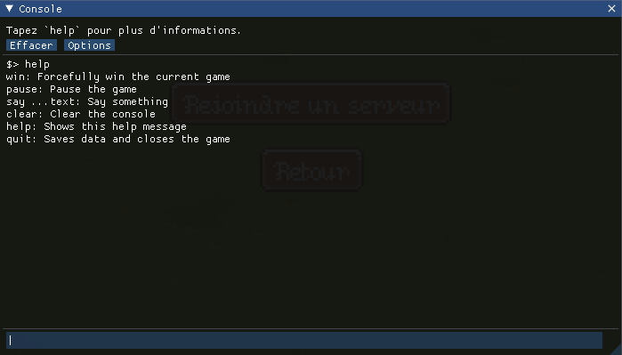
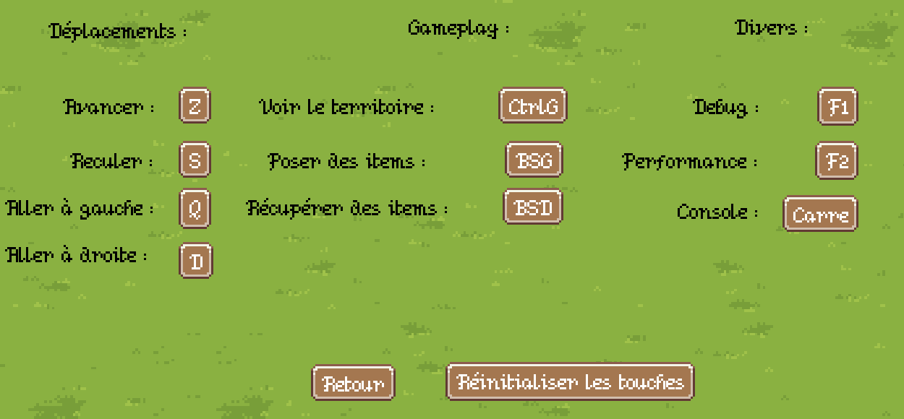
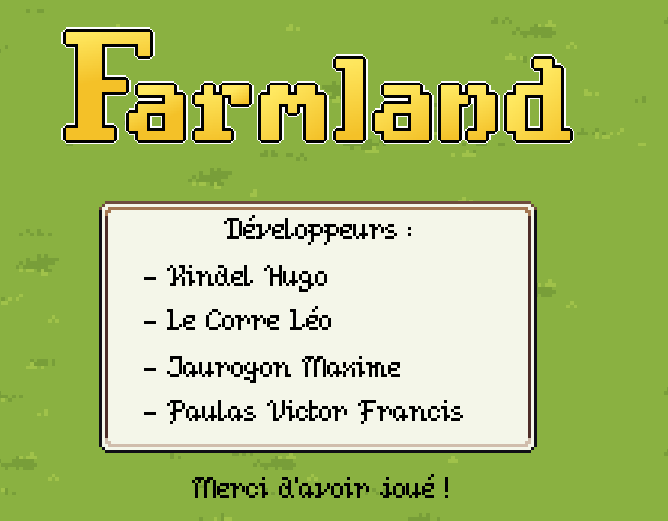

# Instructions de test des fonctionnalités principales

La majeure partie du projet devrait être relativement intuitive à utiliser, mais voici l'aide pour certaines
fonctionnalités primordiale du projet.

## I) Compiler et lancer le jeu

Les instructions pour compiler et lancer le jeu sont présente dans le [README](README.md).

## II) Mode solo

### 1) Création d'une partie

<div align="center">
  
</div>

Lorsque vous arrivez pour la première fois dans le mode solo, vous devez obligatoirement créer une partie à l'aide du
menu que vous pouvez voir ci-dessus, afin de finir la création de la partie vous devrez fournir au moins le nom de la
partie, votre pseudo ainsi que le nom du village. Les autres champs vous permettront de modifier les informations en
question pour personnaliser votre expérience.


### 2) Jouer la partie

Une fois que la partie est créé et que vous êtes dans celle-ci, vous aurez de multiples options à votre disposition pour
remporter la partie :

- Utiliser le marché pour acheter ou vendres vos objets.
- Accéder à votre inventaire pour voir les objets que vous avez achetés et les sélectionner pour pouvoir les poser.
- Envoyer des caravanes pour revendre des objets avec une meilleure rentabilité que le marché (mais un temps d'attente
  sera imposé).
- Améliorer vos recherches pour obtenir de meilleures rentabilitées.
- Aller à la banque pour emprunter le l'argent pour ne pas vous ruiner ou rembourser une partie de votre précédent prêt.
- Finissez le tour actuel.
- Retourner au menu principal quand vous le souhaitez (vous pourrez rejoindre votre partie plus tard, elle sera
  automatiquement sauvegardée).

Pour prendre en main toutes ces options nous vous conseillons de faire votre première partie en solo et sans robot
puis une fois que vous avez compris comment toutes ces actions fonctionnaient, vous pourrez essayer de jouer en solo
avec des robots pour essayer de gagner.

Une dernière chose, Lorsque vous gagnerez ou perdrez-vous serez sur le menu des résultats, il y a deux boutons :
- « Rejouer » qui permet de recréer une partie avec les options que vous avez choisies dans la précédente partie
        et la même graîne (les terrains seront aux même emplacements).
- « Menu Principal » qui vous permet de retourner au menu principal.

<div align="center">
  
</div>

### 2) Charger la partie
   
Lorsque vous voulez faire une pause et que vous quittez votre partie pour revenir plus tard, lorsque vous reviendrez
votre sauvegarde vous ramènera au tour où vous avez quitté le jeu que ce soit votre tour ou celui d'un autre joueur.
Vous retrouverez votre sauvegarde au moment exact ou vous l'avez laissé.

### 3) Supprimer une sauvegarde
   
Le menu de suppression d'une partie est semblable au menu pour charger les parties, à la différence que ça supprime la sauvegarde 
   quand vous cliquez dessus. Un autre moyen de supprimer 
   une partie existante est dans le menu «défaite» ou «victoire» 
   où vous devrez choisir de revenir au «menu principal» 
   pour supprimer votre partie.


## Mode multijoueur

### 1) Lancer le serveur

La création d’une partie dans le mode multijoueur est différent du mode solo, vous devez d'abord lancer le jeu en mode
serveur dédié, pour cela, il suffit de le lancer avec la commande `--server`, si vous ne savez pas comment ajouter
un paramètre à gradle pour démarrer, voici la commande à utiliser :

```
./gradlew run --args="--server"
```

Le serveur devrait alors se lancer en attendant les joueurs.

La capacité par défaut en nombre de joueurs du serveur est de 2, vous devez donc lancer 2 autres instances du jeu
normalement et aller dans le menu « Multijoueur » puis « Rejoindre un serveur » et votre serveur devrait s'afficher.
Vous devriez pouvoir le rejoindre, choisissez un joueur différent dans chacune des deux instances. Une fois les joueurs
créés, la partie devrait se lancer.

Vous devriez ensuite pouvoir jouer tout comme en solo.

### 2) Fermer le serveur

Pour fermer le serveur correctement

### 2) Éditer la configuration serveur

## III) Complémentaire

### 1) Utilisation de la console

   Enfin une nouveauté pour le multijoueur, la console qui permet 
   de faire ces actions :

   *    win : Pour que le joueur qui l’exécute gagne la partie.
   *    pause: Met le jeu en pause, équivalent à l’action de la touche “echap” lorsque le joueur à les droits 
        de le faire.
   *    say : Pour écrire un message avec le nom du joueur qui l’a écrit dans le chat.
   *    clear : Pour nettoyer le chat.
   *    help : Affiche les différentes commandes et leur description.
   *    quit : Pour quitter la partie.





## Paramètres

**1) Manipulation du son :**

   La première option du menu «paramètre» permet de désactiver/activer le son,
   les effets de ce bouton fonctionne sur tous les menus du jeu,
   nous vous conseillons de le désactiver par défaut 
   car celui-ci est assez fort, néanmoins si vous voulez le retrouver 
   celui-ci est dans le dossier :

                 
                     
                  
    

**2) Changement de langue :**
   
   Le changement de langue est un paramètre intéressant, 
   pour le moment, les seuls langages implémentés sont le français et l'anglais,
   que vous pourrez retrouver dans les fichiers de traduction via ce chemin :

                 
                     
                  
    


**3) Redimensionnement de la fenêtre :**
   
   Également nous avons inclus une fonctionnalité permettant de changer 
   la taille de la fenêtre du jeu, pour cela vous avez trois modes possibles :
   
   *    Fenêtré (ou «Windowed» en anglais).
   *    Pleine écran (ou «Fullscreen» en anglais).
   *    Pleine écran sans bordure (ou «Borderless» en anglais).


**4) Commandes :**
   
   Nous avons également ajouté un système de commandes, celui-ci permet de voir
   les touches que vous utilisez actuellement, de changer certaines commandes,
   nous vous conseillons d'essayer de modifier les commandes
   avec les touches du clavier telle que «avancer» (ou «goUp» en anglais),
   puis d'essayer de changer les boutons de la souris «poser un item»
   (ou «putItem» en anglais). 
   Mais faites attention certaines actions ne sont pas possible
   comme attribuer une touche du clavier pour les actions qui requiert
   un bouton de la souris et pareil inversement,
   vous ne pouvez pas choisir une touche qui est déjà attribuée et
   vous ne pourrez pas choisir n'importe quelle touche de votre clavier.
   Également, vous avez un bouton «Réinitialiser les touches» 
   (ou «reset mapping» en anglais) qui vous permet de revenir
   à la configuration initiale (que vous pouvez voir ci-dessous).

   

## Crédit

- Le menu crédit est le dernier menu, celui-ci permet de conclure notre projet qui était de créer un jeu de gestion de la manière la plus réaliste qu'il soit à notre niveau de connaissance actuel.

Nous tenions à vous remercier de nous avoir donné ce projet, il nous a tous beaucoup appris.




   